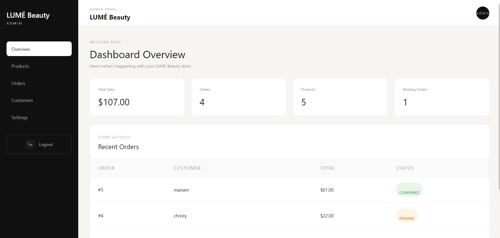

<div align="center">

# LUMÉ Beauty

**A full-stack beauty e-commerce store with a built-in admin dashboard.**

Browse products, build a cart, place an order — and manage everything from a secure admin panel.

[**Live Demo**](https://lume-beauty-pink.vercel.app/) · [**Report a Bug**](https://github.com/idah-hach/lume-beauty/issues)

_The backend runs on a free plan, so the first load may take up to a minute._


</div>

---

## Overview

LUMÉ Beauty is a complete online store built from scratch: a responsive storefront for customers and a protected dashboard for the store owner. Orders are validated on the server, prices are always calculated from the database (never trusted from the client), and stock is updated automatically when an order is placed.

## Features

### Storefront

- Responsive landing page with hero, product collection, about and contact sections
- Product grid with a full-size **lightbox** (keyboard accessible, closes with `Esc`)
- **Cart drawer** with quantity controls, live totals and remove-item
- **Checkout** flow (name, phone, address, notes) with loading, error and success states
- Server-side **stock check** and **price calculation** on every order

### Admin dashboard

- **Authentication** via Supabase Auth (email + password) with protected routes
- **Overview** — revenue, order counts and recent orders at a glance
- **Products** — create, edit, delete, with category, image URL, price and stock
- **Orders** — full order details and status workflow: `Pending → Confirmed → Shipped → Delivered / Cancelled`
- **Customers** — searchable customer list with order history and total spent

## Screenshots

|             Storefront             |              Product lightbox              |
| :--------------------------------: | :----------------------------------------: |
|  |  |

|           Admin dashboard            |
| :----------------------------------: |
|  |

|                 Mobile                 |                   Mobile                   |
| :------------------------------------: | :----------------------------------------: |
|  |  |

> All data shown in the screenshots is demo data.

## Tech Stack

| Layer    | Technology                                                      |
| -------- | --------------------------------------------------------------- |
| Frontend | React 18, React Router 7, Vite 6, custom CSS                    |
| Backend  | Node.js, Express 5, REST API                                    |
| Database | PostgreSQL (Supabase) with Prisma ORM & migrations              |
| Auth     | Supabase Auth (JWT verified on the server)                      |
| Hosting  | Vercel (frontend), Render (backend), Supabase (database & auth) |

## Architecture

```
┌──────────────┐   REST / JSON    ┌────────────────┐    Prisma     ┌────────────────┐
│ React (Vite) │ ───────────────▶ │ Express API    │ ────────────▶ │ PostgreSQL     │
│ storefront + │ ◀─────────────── │ + auth checks  │               │ (Supabase)     │
│ admin panel  │                  └───────┬────────┘               └────────────────┘
└──────┬───────┘                          │ verifies JWT
       │ sign in                          ▼
       └────────────────────────▶  Supabase Auth
```

## API Reference

| Method   | Endpoint            | Access | Description                                      |
| -------- | ------------------- | ------ | ------------------------------------------------ |
| `GET`    | `/api/products`     | Public | List all products                                |
| `POST`   | `/api/products`     | Admin  | Create a product                                 |
| `PUT`    | `/api/products/:id` | Admin  | Update a product                                 |
| `DELETE` | `/api/products/:id` | Admin  | Delete a product                                 |
| `POST`   | `/api/orders`       | Public | Place an order (validates stock, computes total) |
| `GET`    | `/api/orders`       | Admin  | List all orders with items                       |
| `PUT`    | `/api/orders/:id`   | Admin  | Update order status                              |

## Getting Started

### Prerequisites

- Node.js 18+
- A free [Supabase](https://supabase.com) project (Postgres + Auth)

### 1. Clone

```bash
git clone https://github.com/idah-hach/lume-beauty.git
cd lume-beauty
```

### 2. Backend

```bash
cd backend
npm install
cp .env.example .env        # then fill in your Supabase values
npx prisma migrate deploy   # creates the tables
npm run dev                 # API on http://localhost:5000
```

### 3. Frontend

```bash
cd ../frontend
npm install
cp .env.example .env        # then fill in your Supabase values
npm run dev                 # app on http://localhost:5173
```

### 4. Create the admin account

1. In Supabase → **Authentication → Users**, add a user with the email you set as `ADMIN_EMAIL`.
2. Turn **off** public sign-ups (Authentication → Sign In / Providers) so nobody else can register.
3. Sign in at `http://localhost:5173/admin/login`.

### Environment variables

| File            | Variable                        | Description                                        |
| --------------- | ------------------------------- | -------------------------------------------------- |
| `backend/.env`  | `DATABASE_URL`                  | Pooled Postgres connection (runtime)               |
| `backend/.env`  | `DIRECT_URL`                    | Direct Postgres connection (migrations)            |
| `backend/.env`  | `SUPABASE_URL`                  | Supabase project URL                               |
| `backend/.env`  | `SUPABASE_SECRET_KEY`           | Server-side key — never commit or expose           |
| `backend/.env`  | `ADMIN_EMAIL`                   | The only email allowed to use admin endpoints      |
| `frontend/.env` | `VITE_SUPABASE_URL`             | Supabase project URL                               |
| `frontend/.env` | `VITE_SUPABASE_PUBLISHABLE_KEY` | Public (publishable) key                           |
| `frontend/.env` | `VITE_API_URL`                  | Backend URL (e.g. `http://localhost:5000` locally) |

## Project Structure

```
lume-beauty/
├── backend/
│   ├── prisma/            # schema + migrations (Product, Order, OrderItem)
│   └── src/
│       ├── middleware/    # requireAuth / requireAdmin
│       └── server.js      # Express routes
└── frontend/
    ├── public/            # product images
    └── src/
        ├── Components/    # Navbar, Hero, Products, About, Contact, Footer, Checkout
        ├── Dashboard/     # Admin layout, login, overview, products, orders, customers
        └── App.jsx        # routes + cart state
```

## Security Notes

- Secrets live in `.env` files that are git-ignored; only `.env.example` templates are committed.
- The admin API verifies the Supabase JWT on the server and restricts access to `ADMIN_EMAIL`.
- Order totals are computed from database prices, so the client cannot tamper with them.

## Roadmap

- [ ] Persist store settings from the dashboard
- [ ] Image upload for products (Supabase Storage)
- [ ] Order confirmation via email / WhatsApp
- [ ] Online payment integration
- [ ] Automated tests and CI

## Author

**Hadi Araman** — Full-stack developer
[LinkedIn](https://www.linkedin.com/in/hadi-araman-638761368/) · [GitHub](https://github.com/idah-hach)

---

<div align="center">Built with care · LUMÉ Beauty</div>
